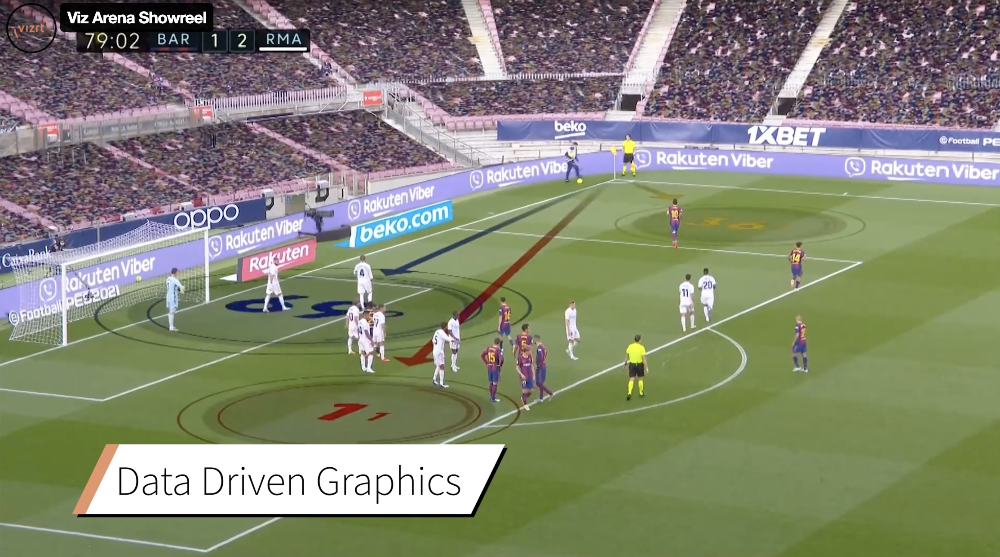
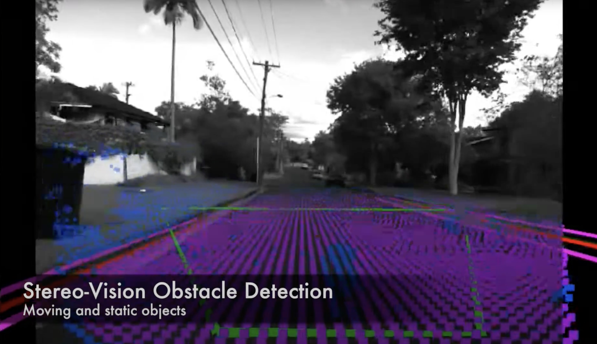

# About Me

I am a Machine Learning engineer based in Switzerland. I'm interested in Computer Vision, Robotics Perception, and building real-time software systems. 

I am an active member of Swiss organisations that support reason, science and freethought. 

  <!--a href="mailto:your.email@example.com" class="contact-link">Email</a> -->
  <a href="https://linkedin.com/in/ralphaeschimann" class="contact-link">LinkedIn</a>
  <a href="https://github.com/aralph" class="contact-link">GitHub</a>
  <a href="assets/pdfs/resume_ralph_aeschimann.pdf" class="contact-link" target="_blank">📄 Resume</a>

# Projects

  
  <h3 class="project-title">routine tracking mobile app</h3>
  
A minimal iOS app for tracking routines and good habits.
  Synchronizes shared routines across devices.

  

    Swift
    CloudKit
  

  
  <h3 class="project-title">Product recognition in retail stores</h3>
  
Tech lead of product recognition team building ShelfView at Scandit.
  Custom models running in cloud-based application.

  

    Python
    PyTorch
    Django
    GCP
  

  
  <h3 class="project-title">Object localization on mobile</h3>
  
Lead ML engineer for detection of barcodes and text on edge devices at Scandit.
  Inference with custom models for 4K 50Hz.

  

    C++
    Python
    PyTorch
  

  
  <h3 class="project-title">Virtual ads for live sports broadcasting</h3>
  
Custom image segmentation models for real-time AR applications at Vizrt.

  

    C++
    Python
    CUDA
    Qt
    TensorFlow
    Caffe2
  

  
  <h3 class="project-title">Autonomous driving</h3>
  
Research on obstacle avoidance for autonomous offroad driving at CSIRO Australia.
  Wheeled robot with stereo vision and Lidar.

  

    C++
    OpenCV
    ROS
  

# Publications

[Aeschimann, R.; Borges, P.V.K., “Ground or Obstacles? Detecting Clear Paths in Vehicle Navigation”, ICRA 2015, IEEE International Conference on Robotics and Automation](https://www.researchgate.net/profile/Paulo-Borges-14/publication/282374576_Ground_or_obstacles_Detecting_clear_paths_in_vehicle_navigation/links/592e6a88a6fdcc89e75b206e/Ground-or-obstacles-Detecting-clear-paths-in-vehicle-navigation.pdf)

# Professional Experience

**Machine Learning Engineer** | *[Google](https://about.google/) (Zürich, Switzerland)* | 10.2025 - Present
- Working in Google Search on improving AI Mode
- Built benchmarking application to track direct tool call quality of LLMs

**Senior Machine Learning Engineer** | *[Scandit](https://www.scandit.com/) (Zürich, Switzerland)* | 08.2021 - 01.2025
- Tech Lead and Python Guild Lead for 40+ engineers
- Built large-scale object detection and classification pipelines, validated with US retailer testset
- Led visual search product development, scaled to >1M images/day with 10 customer pilots
- Increased end-to-end accuracy from 40% to 90% within 18 months
- Grew project squad from 2 to 7 engineers with mentoring and technical leadership

**Machine Learning Engineer** | *[Scandit](https://www.scandit.com/) (Zürich, Switzerland)* | 10.2019 - 07.2021
- Launched real-time ML model for image segmentation running on 1M+ mobile devices monthly
- Trained binary neural networks for smartphones with 30x less memory usage
- Developed multi-stage training algorithms reducing model size by 50% at same quality
- Introduced Python coding guidelines and company-wide Request for Change process

**Computer Vision Engineer** | *[Vizrt](https://www.vizrt.com/) (Zürich, Switzerland)* | 10.2016 - 09.2019
- Developed real-time virtual advertisement overlay system for sports broadcasting
- Deployed neural networks for video segmentation in live TV with 50ms inference on 4K
- Automated training and fine-tuning of networks for customer-specific deployments

**Robotics Research Intern** | *[CSIRO](https://www.csiro.au) (Brisbane, Australia)* | 09.2013 - 08.2014
- Autonomous navigation research for large vehicles on industrial sites using stereo cameras
- Designed vision and LIDAR sensor fusion algorithms for obstacle avoidance

# Interests

I am a supporter of organisations that promote humanist ethics, reason and science.  
Namely, the [Forum for Critical Thinking](https://kritisch-denken.ch/) and the [Freethinkers Association](https://frei-denken.ch/). In the former, I served as Chairmain for seven years. 

I have been a scuba diver for over a decade. My first dive was in 2013 in Brisbane, Australia. 
Since then, I have done over 150 dives around the world. Some of my favourite spots are 

